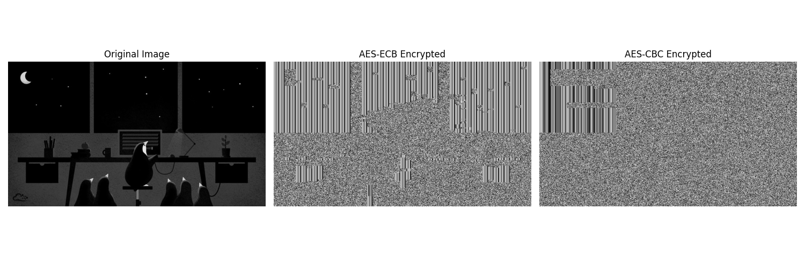

# Laboratorio 2 - Parte 1
## Cifrado de Información
### José Daniel Gómez Cabrera 21429

Nota: No se pueden mostrar imagenes ppm en markdown, por lo que se adjunta una imagen de comparación en formato PNG.

### Comparación

## Preguntas para reflexión
1. ¿Por qué el cifrado ECB revela los patrones de la imagen?
   - El modo ECB (Electronic Code Book) revela patrones en la imagen porque cifra cada bloque de datos de forma independiente con la misma clave. Esto significa que bloques idénticos de texto plano siempre producirán bloques idénticos de texto cifrado. En imágenes, particularmente aquellas con grandes áreas del mismo color o patrones repetitivos (como la barriga blanca de Tux), estos bloques idénticos se vuelven evidentes en el resultado cifrado. Como ECB no utiliza ningún tipo de encadenamiento o mecanismo de retroalimentación, la estructura y los patrones de la imagen original permanecen visibles en la versión cifrada, solo con el contenido real de cada bloque alterado. Esta propiedad fundamental de ECB lo convierte en una mala elección para cifrar datos con patrones o estructuras inherentes, ya que el resultado cifrado filtra información sobre el texto plano.

2. ¿Cómo cambia la apariencia con CBC?
   - Con el modo CBC (Cipher Block Chaining), la apariencia de la imagen cifrada cambia drásticamente para asemejarse a ruido aleatorio. CBC funciona realizando una operación XOR entre cada bloque de texto plano y el bloque cifrado anterior antes del cifrado, creando una cadena de dependencia entre bloques. El primer bloque se combina mediante XOR con un vector de inicialización (IV). Este mecanismo de encadenamiento asegura que bloques idénticos de texto plano produzcan diferentes bloques de texto cifrado dependiendo de su posición y contenido precedente. Como resultado, la imagen cifrada con CBC aparece completamente aleatorizada sin patrones discernibles, incluso cuando la imagen original contiene grandes áreas uniformes o elementos repetitivos. La imagen cifrada no muestra ninguna relación visual con la original, proporcionando una confidencialidad adecuada.

3. ¿Qué tan seguro es usar ECB para cifrar datos estructurados? 
   - Usar ECB para cifrar datos estructurados es fundamentalmente inseguro y debe evitarse en prácticamente todas las aplicaciones sensibles a la seguridad. La preservación de patrones hace que ECB sea vulnerable a análisis estadísticos, análisis de frecuencia y ataques de reconocimiento de patrones. Para datos estructurados como imágenes, bases de datos o texto con elementos repetitivos, estas vulnerabilidades se vuelven aún más pronunciadas. Aunque los bloques individuales se cifran con un algoritmo seguro (AES), el modo de operación (ECB) socava la seguridad de todo el sistema. Esta demostración con imágenes proporciona una confirmación visual impactante de por qué los criptógrafos advierten constantemente contra el uso del modo ECB. Para el cifrado seguro de datos estructurados, se deben utilizar modos como CBC, CTR, GCM u otros modos de cifrado autenticado, ya que oscurecen los patrones y proporcionan propiedades de seguridad adicionales como autenticación y protección de integridad.
