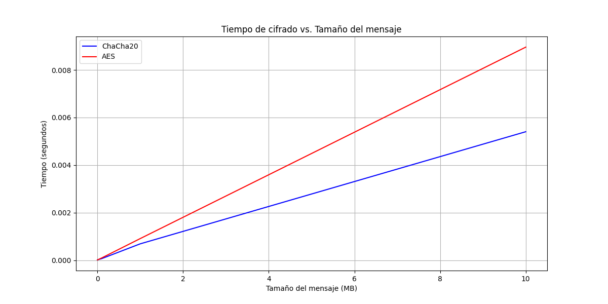
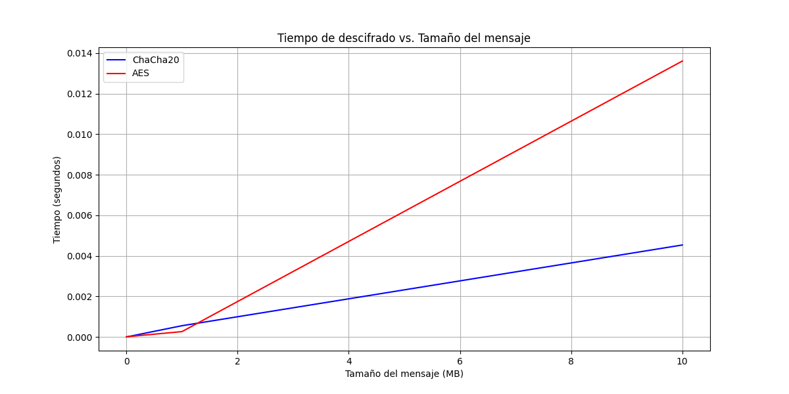
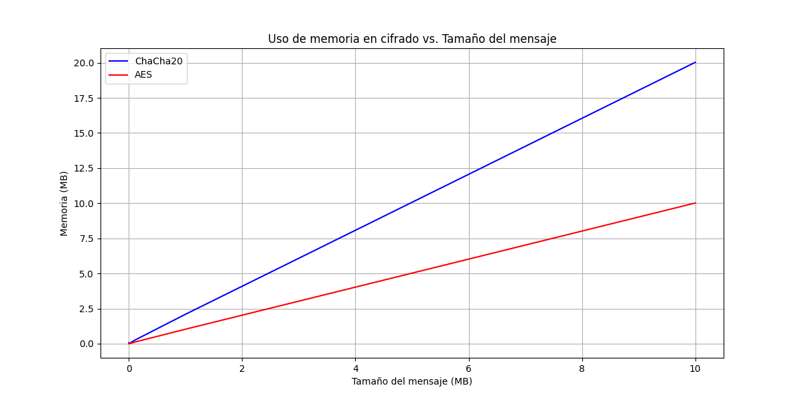
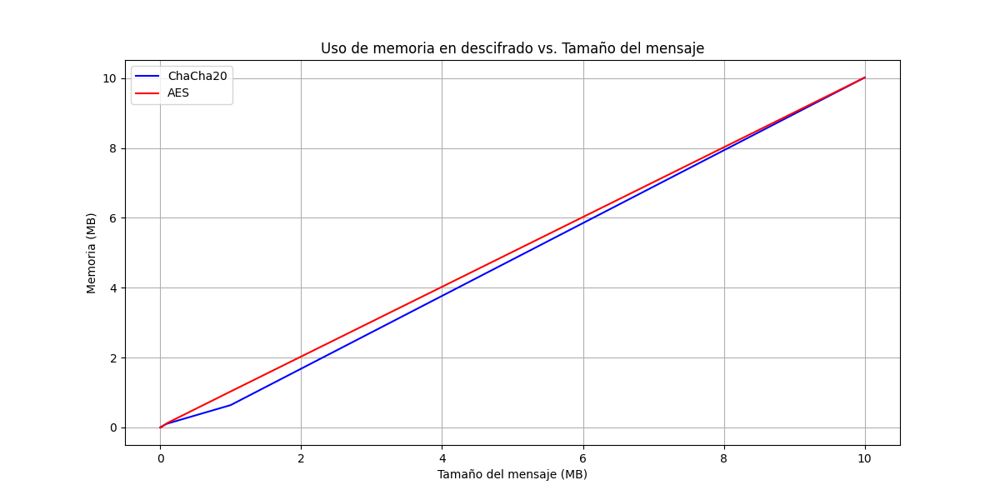

# Laboratorio 3 - Parte 3
## Cifrado de Información
### José Daniel Gómez Cabrera 21429

### Preguntas para reflexión:

1. ¿Analizar que cifrado es mas rápido ChaCha20 o AES?
   - ChaCha20 generalmente demuestra un mejor rendimiento que AES en implementaciones de software puro, especialmente en dispositivos que no cuentan con aceleración hardware específica para AES. Esto se debe a que ChaCha20 fue diseñado para ser eficiente en software, utilizando operaciones simples como rotaciones, XOR y adiciones que son ejecutadas rápidamente por los procesadores modernos. La arquitectura de ChaCha20 aprovecha mejor las capacidades de los procesadores actuales para cálculos en paralelo. Sin embargo, es importante destacar que en sistemas equipados con instrucciones especializadas como AES-NI (Intel) o hardware dedicado para AES, el rendimiento de AES puede superar significativamente al de ChaCha20. Esta diferencia es particularmente notable en servidores y computadoras de escritorio de gama alta que incluyen estas optimizaciones de hardware.
   - En funcion de los resultados de rendimiento (las gráficas al final de este Readme) puedo sugerir que ChaCha20 puede usarse cuando el tiempo de descifrado es crítico, porque este tarda mucho menos en cifrar y descifrar que el AES. Sin embargo el costo computacional es mayor en el tiempo de cifrado como lo muestra la gráfica número 3. Para descifrar ambos tiempos son muy similares.

2. ¿En qué casos debería usarse en vez de AES?
   - ChaCha20 debe preferirse sobre AES en varios escenarios específicos: en dispositivos con recursos limitados como sistemas IoT, microcontroladores o dispositivos móviles donde cada ciclo de CPU y byte de memoria son valiosos; en implementaciones de software donde no se dispone de aceleración hardware para AES; en aplicaciones que requieren protección contra ataques de canal lateral, ya que ChaCha20 es naturalmente resistente a análisis de tiempo al no utilizar tablas de sustitución dependientes de datos; en conexiones de red lentas o inestables, siendo esta la razón por la que ChaCha20-Poly1305 se ha convertido en el estándar recomendado para TLS 1.3 en dispositivos móviles; y finalmente, en situaciones donde se valora la simplicidad de implementación y auditoría de seguridad, pues ChaCha20 tiene un diseño más transparente y menos propenso a errores de implementación que podrían comprometer la seguridad del sistema.
   - Puedo sugerir que ChaCha20 es útil para los casos en los que se requiera un cifrado rápido, y en el cual no haya un requisito de utilizar el menor costo computacional posible, para cifrar.
   - Mientras que AES es mejor para los casos en los cuales se necesita el menor costo computacional posible, a coste de utilizar más tiempo de cifrado y descrifrado, como en teléfonos o equipos no tan potentes.

#### Mensaje original
"Este es un mensaje secreto que quiero cifrar"

### ChaCha20
- d134e57162ee70993d6df92eb2a5dbef09fef590cd560978f9
- Tiempo promedio de cifrado: 0.001238 segundos
- Tiempo promedio de descifrado: 0.001035 segundos
- Uso promedio de memoria en cifrado: 4.5 MB
- Uso promedio de memoria en descifrado: 2.15625 MB

### AES (Advanced Encryption Standard)
- 44806d050f2cbe1119ebb35c9b3244d4e0f619dbe9c1ddd0dc
- Tiempo promedio de cifrado: 0.001998 segundos
- Tiempo promedio de descifrado: 0.002787 segundos
- Uso promedio de memoria en cifrado: 2.23125 MB
- Uso promedio de memoria en descifrado: 2.234375 MB

### Resultados de rendimiento

